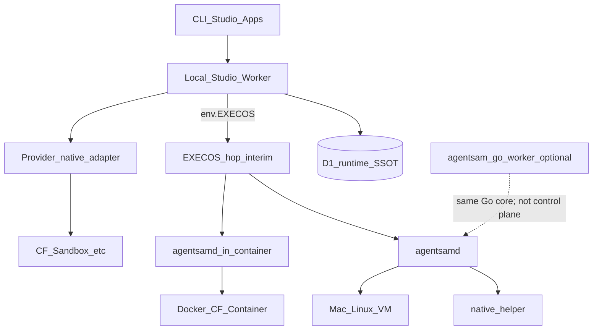

# AgentSam Runtime Protocol

> Branch: `feat/runtime-protocol-agentsamd`. Law: **agentsamd is the machine daemon; providers are adapters.**

## Architectural law (non-negotiable)

**agentsamd is the AgentSam machine/runtime daemon. Providers are adapters beneath it.**

Do not implement “AgentSam-for-Docker,” “AgentSam-for-GCP,” or “AgentSam-for-CF-Containers” as separate products. One protocol; many substrates.

| Noun | Role |
|---|---|
| **agentsamd** | Lives with execution: exec, PTY, fs, processes, git, tools, capabilities, attach |
| **Native helper** (this sprint) | Privileged companion (Rust/Zig) under unprivileged Go: keychain, mounts, devices |
| **EXECOS Worker** (`env.EXECOS` / `EXECOS_IAM`) | **Today’s** cloud→machine hop + enrollment consume + session/job/port-forward writes. Interim fabric until agentsamd is enrolled everywhere — **not** a second product brand |
| **PTY_SERVICE** | Separate VPC/PTY health lane (metal), not the daemon |
| **agentsam-go-worker** | Optional **hosted Go service** (hash/inspect/runtime HTTP on CF Containers). Reuses the same Go core as agentsamd. **Not** the Studio control plane and **not** a substitute for EXECOS or D1 |
| **Agent runtimes** (ADK / Vertex Agent Engine) | Agent-loop authority — **consumes** AgentSam compute; never a machine instance |
| **Local Studio Worker** | Stock app host: auth session, D1 SSOT, bindings (`EXECOS`, `PTY_SERVICE`), runtime APIs |

### EXECOS vs agentsam-go-worker (do not conflate)

```text
Studio / IAM Worker
  ├─ D1 SSOT (runtime_* after cutover)
  ├─ env.EXECOS / EXECOS_IAM  →  ExecOS dispatcher  →  enrolled machine hop
  └─ env.PTY_SERVICE          →  VPC PTY health

agentsam-go-worker            →  separate hosted service artifact
agentsamd (+ native helper)   →  the computer (user machine / VM / container image)
```

Control-plane verbs (enroll, health, job ledger, session ownership) already land through **Studio/IAM + EXECOS + D1**. Do not invent a parallel “go-worker is the terminal control plane” story. go-worker stays a service package that shares Go core with agentsamd.

---

## Four independent axes (replace overloaded kind)

```text
provider     local | cloudflare | gcp | aws | azure | fly | …
substrate    host | vm | container | microvm | sandbox | workstation | kubernetes
lifecycle    persistent | scale_to_zero | ephemeral | job
runtime      agentsamd | sandbox_api | provider_native
transport    direct | service_binding | tunnel | vpc_service | vpc_network | public_wss | provider_api
```

**PTY is a capability, not the daemon.** Runtimes report `pty: true|false` honestly.

`managed_agent` is **not** a machine class — it sits beside as agent_runtime.

---

## Control plane map



---

## Installation grades (this sprint)

| Grade | What | Sprint |
|---|---|---|
| **Full daemon** | Go `agentsamd` | Yes — MVP + enroll + LaunchAgent/systemd |
| **Native helper** | Rust/Zig privileged helper | Yes — keychain / mounts / devices with daemon |
| **Embedded SDK** | TS/Python runtime lib | Protocol client first; embed later in same epic if blocked |
| **Provider adapter** | No daemon | CF Sandbox path |

**Language priority:** Go canonical daemon → TypeScript protocol client → Rust/Zig native helper (this sprint) → Python ML/CAD embed.

**Stock user123 path:**

```bash
agentsam setup runtime
agentsam machine install --enroll
```

Writes only `connection_token` profile + LaunchAgent/systemd. Never platform `AGENTSAM_BRIDGE_KEY`. Never Sam’s `~/.agentsam/load-agent-env.sh`.

Public OAuth client ids: Studio Worker vars → `/api/public-config` → CLI resolve.

### Google consent branding note

Consent chrome may show **inneranimalmedia.com** until Google brand-verifies the OAuth app name. Redirect host is still `agentsam.inneranimalmedia.com`. That is Google Auth Platform behavior (authorized domain fallback), not a second login product. Fix is Console branding verification — not routing CLI auth through IAM main for “stock.”

---

## Reference substrates (ship order)

| Class | Axes example | Runtime |
|---|---|---|
| Native host | `local` × `host` × `persistent` | agentsamd + native helper + launchd/systemd |
| Local Docker | `local` × `container` | agentsamd in image |
| GCP VM | `gcp` × `vm` × `persistent` | agentsamd + systemd (+ tunnel/VPC) |
| CF Container | `cloudflare` × `container` | agentsamd image; DO = lifecycle adapter only |
| CF Sandbox | `cloudflare` × `sandbox` × ephemeral | **sandbox_api adapter** |

---

## `agentsam setup runtime` (GOAP + utility)

Discover → goal profiles → hard constraints → GOAP install plan → utility rank → approve → receipts.

```text
agentsam setup runtime
agentsam runtime list|inspect|attach|doctor|stop|remove
agentsam go                    # Go product/runtime inspector — not placement
agentsam google-cloud          # advanced provider CLI
```

---

## Protocol surface (`agentsam.runtime.v1`)

```text
identity / capabilities / health
exec / spawn / signal / terminate
pty.create|attach|resize|detach
fs.read|write|list|watch
ports.list|expose
system.inspect
```

---

## D1 hard cutover (no half measures)

**Reject:** widening `transport CHECK` to add `agentsamd` while leaving `execos` baked into table names, job columns, and SDK APIs.

**Accept:** one published rename of the spine to `runtime_*`, four-axis instances, transport without ExecOS as an identity, seed migrate the two live machines, update IAM + Studio + ExecOS consumers in the same ship.

Live inventory (2026-09-26 remote `inneranimalmedia-business`):

| Legacy table | Rows | Disposition |
|---|---|---|
| `terminal_instances` | 2 | **DROP** after migrate → `runtime_instances` |
| `terminal_connections` | 2 | **DROP** after migrate → `runtime_connections` |
| `terminal_connection_credentials` | 2 | **DROP** → `runtime_connection_credentials` |
| `terminal_enrollment_tokens` | 10 | **DROP** → `runtime_enrollment_tokens` |
| `terminal_sessions` | 0 | **DROP** → `runtime_sessions` |
| `terminal_jobs` | 1283 | **DROP** → `runtime_jobs` (history optional archive first) |
| `terminal_port_forwards` | 25 | **DROP** → `runtime_port_forwards` |
| `cloud_provider_connections` | keep | Provider credential plane (GCP WIF/etc.) — not renamed |
| `agentsam_cli_oauth_*` | keep | CLI OAuth broker pending/pickup — unrelated |

### Target DDL (authoritative)

```sql
-- runtime_instances: one enrolled computer (axes, not overloaded kind)
CREATE TABLE runtime_instances (
  id TEXT PRIMARY KEY,                          -- keep tinst_* ids on seed migrate
  account_id TEXT NOT NULL REFERENCES accounts(id) ON DELETE CASCADE,
  name TEXT NOT NULL,
  provider TEXT NOT NULL CHECK(provider IN (
    'local','cloudflare','gcp','aws','azure','fly','custom'
  )),
  substrate TEXT NOT NULL CHECK(substrate IN (
    'host','vm','container','microvm','sandbox','workstation','kubernetes'
  )),
  lifecycle TEXT NOT NULL DEFAULT 'persistent' CHECK(lifecycle IN (
    'persistent','scale_to_zero','ephemeral','job'
  )),
  runtime TEXT NOT NULL DEFAULT 'agentsamd' CHECK(runtime IN (
    'agentsamd','sandbox_api','provider_native'
  )),
  provider_connection_id TEXT REFERENCES cloud_provider_connections(id) ON DELETE SET NULL,
  provider_resource_id TEXT,
  provider_location TEXT,
  hostname TEXT,
  os TEXT CHECK(os IN ('linux','macos','windows') OR os IS NULL),
  arch TEXT,
  default_shell TEXT,
  default_cwd TEXT,
  capabilities_json TEXT NOT NULL DEFAULT '{}',  -- discovered, never inferred
  status TEXT NOT NULL DEFAULT 'provisioning' CHECK(status IN (
    'provisioning','ready','offline','stopped','failed','deleting'
  )),
  expires_at INTEGER,
  metadata_json TEXT NOT NULL DEFAULT '{}',
  created_at INTEGER NOT NULL DEFAULT (unixepoch()),
  updated_at INTEGER NOT NULL DEFAULT (unixepoch()),
  last_seen_at INTEGER,
  UNIQUE(account_id, id),
  CHECK (provider <> 'gcp' OR provider_connection_id IS NOT NULL)
);

-- runtime_connections: how Studio reaches the instance (identity ≠ transport)
CREATE TABLE runtime_connections (
  id TEXT PRIMARY KEY,
  account_id TEXT NOT NULL REFERENCES accounts(id) ON DELETE CASCADE,
  instance_id TEXT NOT NULL,
  name TEXT NOT NULL,
  transport TEXT NOT NULL CHECK(transport IN (
    'direct','service_binding','tunnel','vpc_service','vpc_network',
    'public_wss','provider_api'
  )),
  endpoint_url TEXT,
  auth_mode TEXT NOT NULL CHECK(auth_mode IN (
    'connection_token','platform_bridge','service_binding'
  )),
  credential_ref TEXT,
  is_default INTEGER NOT NULL DEFAULT 0 CHECK(is_default IN (0,1)),
  is_active INTEGER NOT NULL DEFAULT 1 CHECK(is_active IN (0,1)),
  priority INTEGER NOT NULL DEFAULT 50,
  health_status TEXT NOT NULL DEFAULT 'unknown' CHECK(health_status IN (
    'unknown','healthy','degraded','unreachable'
  )),
  health_checked_at INTEGER,
  health_error TEXT,
  -- optional CF/tunnel metadata (nullable; not transport identity)
  cloudflare_account_id TEXT,
  cloudflare_tunnel_id TEXT,
  dns_zone_id TEXT,
  dns_record_id TEXT,
  access_application_id TEXT,
  access_service_token_id TEXT,
  access_credential_ref TEXT,
  route_hostname TEXT,
  origin_service TEXT,
  provider_metadata_json TEXT NOT NULL DEFAULT '{}',
  created_at INTEGER NOT NULL DEFAULT (unixepoch()),
  updated_at INTEGER NOT NULL DEFAULT (unixepoch()),
  UNIQUE(account_id, instance_id, id),
  FOREIGN KEY(account_id, instance_id)
    REFERENCES runtime_instances(account_id, id) ON DELETE CASCADE,
  CHECK (transport <> 'direct' OR endpoint_url IS NOT NULL)
);

CREATE TABLE runtime_connection_credentials ( /* same shape as tcc_*; rename FKs */ );
CREATE TABLE runtime_enrollment_tokens ( /* same shape; rename FKs */ );
CREATE TABLE runtime_sessions ( /* PTY attach ledger; rename FKs */ );
CREATE TABLE runtime_jobs (
  /* same operational columns; rename execos_run_id → hop_run_id */
);
CREATE TABLE runtime_port_forwards ( /* rename FKs */ );

CREATE TABLE runtime_preferences (
  account_id TEXT PRIMARY KEY REFERENCES accounts(id) ON DELETE CASCADE,
  profile_json TEXT NOT NULL DEFAULT '{}',
  updated_at INTEGER NOT NULL DEFAULT (unixepoch())
);
```

### Seed map (preserve IDs)

| Legacy | New axes |
|---|---|
| `tinst_sams_imac` local_device/local | `provider=local`, `substrate=host`, `lifecycle=persistent`, `runtime=agentsamd` (target; may stay hop=`service_binding` until daemon enrolled) |
| `tinst_iam_tunnel` vm/google_cloud | `provider=gcp`, `substrate=vm`, `lifecycle=persistent`, `runtime=agentsamd` |
| `conn_mac_local` transport=execos | `transport=direct` (or `public_wss`), endpoint kept |
| `conn_gcp_iam_tunnel` transport=execos + platform_bridge | `transport=service_binding` or `direct` + `auth_mode=platform_bridge` |

**Forbidden after cutover:** `transport='execos'` as a column value. ExecOS is an **implementation hop** behind `service_binding` / Studio binding — not a user-facing transport enum.

### Ship sequence (same PR epic)

1. Migration SQL in `inneranimalmedia/migrations/` (archive `terminal_jobs` → `_archive_terminal_jobs_20260926` if you want forensics, then DROP).
2. Rewrite IAM `backend/agentsam/terminal/**` → `runtime/**` (or thin re-export for one release max — prefer hard rename in SDK published surface).
3. ExecOS `IamExecutionEntrypoint` SQL table names.
4. Studio CLI: `agentsam terminal *` → `agentsam runtime *` (alias one release then delete).
5. Protocol package enums already omit `execos` as identity (remove from `RUNTIME_TRANSPORTS`).
6. Deploy IAM + Studio + ExecOS together; no dual-write period longer than the cutover window.

### Explicitly not “compat forever”

- No dual `terminal_*` + `runtime_*` for months.
- No `CHECK (... OR 'execos')` soft patch.
- No documenting ExecOS as the stock machine for user123.

---

## Implementation order (this sprint)

1. Protocol schema + shared types (**done**)
2. Public-config + CLI Google broker (**done**)
3. **D1 hard cutover** `terminal_*` → `runtime_*` (above)
4. **agentsamd MVP** + enroll + LaunchAgent/systemd
5. **Native helper** (keychain/mounts/devices) alongside daemon
6. Studio control plane + machines UI on `runtime_*`
7. **`agentsam setup runtime`** GOAP + utility + receipts
8. Reference adapters (host, docker, gcp/vm, cf/container, cf/sandbox)

---

## Rejected

- IAM-only terminal plane with Studio as dumb proxy
- Stock dependence on operator `load-agent-env.sh`
- Provider-branded duplicate daemons
- Treating managed agent runtimes as machine instances
- Inferring capabilities from provider name
- Soft-scoring past hard requirements
- Widening legacy CHECKs instead of renaming the spine
- Casting `agentsam-go-worker` as the EXECOS/control-plane replacement

---

## Success criteria

- User123: Studio sign-in → `setup runtime` → enrolled **agentsamd** (+ native helper on host) → attach — no Sam shell files, no `~/ExecOS` clone required.
- Same protocol image/daemon on Mac, GCP VM, Docker, CF Container; Sandbox uses adapter.
- Transport can change without renaming the instance.
- D1 speaks `runtime_*` only; `execos` is not a user-facing transport.
- `agentsam-go-worker` remains an optional hosted service; **EXECOS** remains interim hop; **agentsamd** remains the computer.
