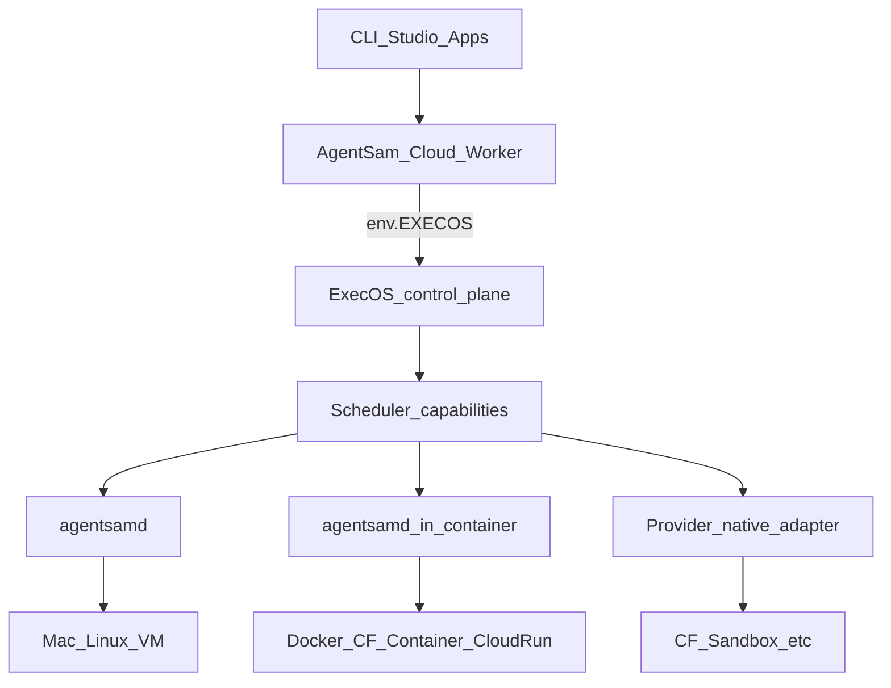

# AgentSam Runtime Protocol

> Branch work: `feat/runtime-protocol-agentsamd`. Canonical law: **agentsamd is the machine daemon; providers are adapters.**

# AgentSam Runtime Protocol + stock multi-machine

## Architectural law (non-negotiable)

**agentsamd is the AgentSam machine/runtime daemon. Providers are adapters beneath it.**

Do not implement “AgentSam-for-Docker,” “AgentSam-for-GCP,” or “AgentSam-for-CF-Containers” as separate slightly different products. One protocol; many substrates.

Keep separate:

| Noun | Role |
|---|---|
| **agentsamd** | Lives with execution: exec, PTY, fs, processes, git, tools, capabilities, attach |
| **agentsam-go-worker** | Cloud/control service: provision, provider APIs, discovery, health, register, job dispatch, CF integration — **not** “the computer” |
| **Agent runtimes** (ADK / Vertex Agent Engine) | Agent-loop authority — **consumes** AgentSam compute; never a machine_instance |
| **Local Studio Worker** | Self-sustaining app host: auth session, D1, `EXECOS`, `PTY_SERVICE`, runtime APIs for stock users |

---

## Four independent axes (replace overloaded kind)

```text
provider     local | cloudflare | gcp | aws | azure | fly | …
substrate    host | vm | container | microvm | sandbox | workstation | kubernetes | managed_agent*
lifecycle    persistent | scale_to_zero | ephemeral | job
transport    direct | service_binding | tunnel | vpc_service | vpc_network | public_wss | provider_api
```

\* `managed_agent` is **not** a machine class in the scheduler — it sits beside as agent_runtime.

**PTY is a capability, not the daemon.** Runtimes report `pty: true|false` honestly.

---

## Control plane map



Studio Production bindings stay first-class doors for the **stock app host** (`DB`, `EXECOS`, `PTY_SERVICE`, …) — not a substitute for per-account `runtime_instances` rows.

---

## Schema evolution

From:

```text
terminal_instances.kind ∈ { local_device, vm, sandbox }
terminal_connections.transport ∈ { execos, container, … }
```

Toward:

```text
runtime_instances
  account_id, provider, substrate, lifecycle, runtime∈{agentsamd,sandbox_api,provider_native}
  architecture, os, status, capabilities_json (discovered)

runtime_connections
  instance_id, transport, endpoint_ref, credential_ref, health_status
```

**Instance identity ≠ transport.** Same GCP VM can move `public_wss` → `tunnel` → `vpc_service` without changing the instance row.

Compat: keep reading legacy `terminal_*` during cutover; `target_lane` remains derived, never authority.

---

## Installation grades

| Grade | What | When |
|---|---|---|
| **Full daemon** | Go `agentsamd` binary | Mac/Linux/VM/Docker/CF Container/workstation |
| **Embedded SDK** | TS/Python runtime lib | App embeds AgentSam |
| **Provider adapter** | No daemon | CF Sandbox, Docker API, SSH, managed APIs |
| **Native helper** (later) | Rust/Zig privileged helper | keychain, mounts, devices under unprivileged Go daemon |

**Language priority:** Go canonical daemon → TypeScript protocol client/plugins → Python ML/CAD embed → Rust helper/hardened → others on demand.

**Stock user123 path:**

```bash
agentsam setup runtime          # goal profiles, not provider menus
# or after plan approve:
agentsam machine install --enroll
```

Writes only `connection_token` profile + LaunchAgent/systemd. Never platform `AGENTSAM_BRIDGE_KEY`. Never require Sam’s `~/.agentsam/load-agent-env.sh`.

Public OAuth client ids: Studio Worker vars → `/api/public-config` → CLI resolve.

---

## Reference substrates (ship order)

**First-class**

| Class | Axes example | Runtime |
|---|---|---|
| Native host | `local` × `host` × `persistent` | agentsamd + launchd/systemd |
| Local Docker | `local` × `container` × persistent\|ephemeral | agentsamd in image |
| GCP VM | `gcp` × `vm` × `persistent` | agentsamd + systemd (+ tunnel/VPC) |
| CF Container | `cloudflare` × `container` × often scale_to_zero | agentsamd image; DO = lifecycle adapter only |
| CF Sandbox | `cloudflare` × `sandbox` × ephemeral | **sandbox_api adapter** (no forced daemon) |

**Then:** Cloud Run, Workstation, Fly Machines, Fargate, Azure Container Apps.  
**Later:** K8s fleets, GPU/batch.  
**Beside (not machine):** Google ADK / Agent Runtime.

---

## `agentsam setup runtime` (GOAP + utility)

Home: existing Discover → Plan → Approve — **not** `setup gcp|docker|cloudflare` as the primary UX.

1. **Discover** (providers publish facts via `discover/doctor/listInstances/capabilities/estimate/plan/apply`)
2. Ask **goal profiles** (five): My Computer | Isolated Local | Cloud Computer | On-demand | Safe Sandbox (+ Advanced existing infra)
3. Ask only preference deltas that change the plan
4. **Hard constraints** eliminate ineligible candidates (never soft-score past a missing required capability)
5. **GOAP** builds install plans (actions: create_vm, install_agentsamd, configure_transport, enroll, health)
6. **Utility** ranks eligible plans; human approves
7. **Receipts:** `.agentsam/runtime/latest.plan.json` + `latest.install-receipt.json`

Remember `runtime_preferences` per account; project requirements always win.

Clean nouns:

```text
agentsam setup runtime
agentsam runtime list|inspect|attach|doctor|stop|remove
agentsam go                    # Go product/runtime inspector — not placement
agentsam google-cloud          # advanced provider CLI
```

---

## Protocol surface (`agentsam.runtime.v1`)

```text
identity / capabilities / health
exec / spawn / signal / terminate
pty.create|attach|resize|detach
fs.read|write|list|watch
ports.list|expose
system.inspect
```

Scheduler asks for **capabilities** (“terminal + git + docker + 8GB”), not “a GCP VM.”

---

## Rejected

- IAM-only terminal plane with Studio as dumb proxy
- Stock dependence on operator `load-agent-env.sh`
- Provider-branded duplicate daemons
- Treating managed agent runtimes as `machine_instance`
- Inferring capabilities from provider name instead of discovery
- Soft-scoring past hard requirements

---

## Implementation order

1. **Protocol + capability schema** (docs + shared TS/Go types)
2. **Public-config + CLI resolve** (unblocks gcloud desktop auth for stock)
3. **Schema migrate** `runtime_*` with compat over `terminal_*`
4. **Go agentsamd MVP** + enroll + LaunchAgent; interim wrap ExecOS if needed
5. **Studio control plane** on existing bindings; Terminal machines UI
6. **`agentsam setup runtime`** planner (five profiles + receipts)
7. **Reference adapters** (host, docker, gcp/vm, cf/container, cf/sandbox)

---

## Success criteria

- User123: sign into Studio → `setup runtime` / machine install → enrolled agentsamd → attach — no Sam shell files, no `~/ExecOS` clone required.
- Same protocol image/daemon works on Mac, GCP VM, Docker, CF Container; Sandbox uses adapter.
- Transport can change without renaming the instance.
- Preferences and plan receipts explain “why this backend” without LLM invention.
- `agentsam-go-worker` remains a service; agentsamd remains the computer.
