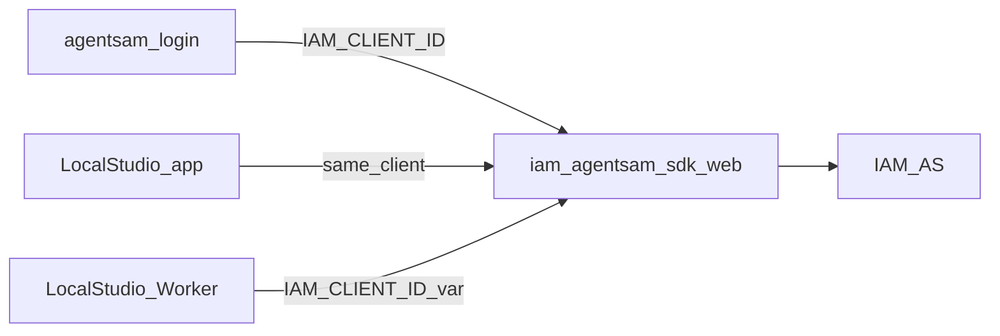
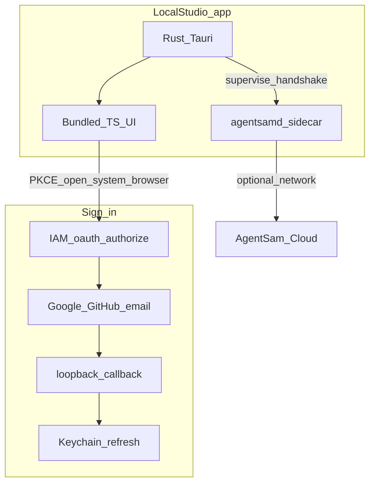
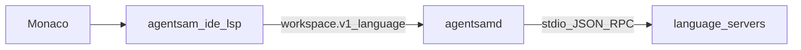

# Local Studio Graduation + Windows Runtime

> **Non-negotiable contract (2026-09-27):**  
> [`LOCAL-STUDIO-REAL-APP-CONTRACT-ADDENDUM-2026-09-27.md`](./LOCAL-STUDIO-REAL-APP-CONTRACT-ADDENDUM-2026-09-27.md)  
> Real bundled client (no product-critical redirect to hosted Studio); shared UI + RuntimeHost; Tauri vs agentsamd split; mock ≠ done; Content Studio / Media acceptance (Sites → Media, desktop optimize not Nitro-universal). **This addendum wins** over scaffold / “Open Studio UI = cloud” shortcuts in this plan or boot copy.

## Preconditions (already done)

- IAM runtime registry restore is live: commit `109410f19` on `main`, Worker healthy, D1 `runtime_adapter=execos_legacy` — no further restore work ([Restore IAM runtime registry](09fb7f86-daa8-401e-b546-69734a8cbbfc)).

## Codebase facts (from shell explore)

Confirmed by [Explore Local Studio desktop](cec9baf0-5068-43ae-9924-20649b248584):

- Shell is **remote-URL only**: `build-brand.mjs` sets `app.windows[0].url` to `base_url+launch_path`; `dist/index.html` is a placeholder.
- **No TypeScript in** `packages/agentsam-desktop-shell` — product UI lives in `apps/local-studio` (wire build → shell `dist/`).
- Auth in shell today: Keychain + deep-link emit only; **no PKCE/loopback**. Copy CLI pattern from `src/lib/google-desktop-oauth.js` / `createLoopbackCallbackListener` in `auth.js`.
- **No** `externalBin` / agentsamd supervision; `local_node.rs` is terminal enroll only.
- `icon_mark_svg` is on the manifest but **`build-brand.mjs` never reads it** — only PNG/`AGENTSAM_ICON_URL`; `icons/local-studio/` has SVG, no `icon.png`.

## Scope for this implementation pass

Ship **Phases 1–5 in full** (Phase 5 is a real IDE product cut, not stubs). Auth SSOT + Windows + offline shell remain prerequisites so Monaco/xterm/LSP have a machine runtime.

### Auth SSOT (mandatory — prior plan was wrong)

**One product OAuth client for AgentSam Studio + CLI:**

| Surface | Client |
|---|---|
| Local Studio Worker (production) | `IAM_CLIENT_ID=iam_agentsam_sdk_web` |
| Local Studio desktop app | same — `iam_agentsam_sdk_web` |
| `agentsam login` / SDK CLI OAuth | same — `iam_agentsam_sdk_web` |

`iam_cli_agentsam` is **not** on production Workers and is **not** the login client. Treat it as a mistaken parallel “native CLI” lane. Plan work removes it as the authority for CLI tokens.

**Required code/doc changes:**

1. **IAM** ([`agentsam-account-credentials.js`](/Users/samprimeaux/inneranimalmedia/backend/auth/agentsam-account-credentials.js)): `resolveNativeCliClientId` / `DEFAULT_NATIVE_CLI_CLIENT_ID` must resolve to **`iam_agentsam_sdk_web`** (or accept tokens whose `oauth_clients.client_id` is that production client). Stop requiring `iam_cli_agentsam` for `oauth_cli` / SDK API auth.
2. **SDK** [`src/lib/auth.js`](/Users/samprimeaux/agentsam-sdk/src/lib/auth.js): `agentsam login` must use `iam_agentsam_sdk_web` (env from vault / documented default aligned with Local Studio Worker — not inventing `iam_cli_agentsam`). Loopback redirects allowed on that client (or Worker-mediated exchange keeping secret on Worker).
3. **Docs/contracts** that say “native CLI = `iam_cli_agentsam`” (`sdk-auth-contract-consumer.md`, CATALOG, etc.) rewritten to **`iam_agentsam_sdk_web` = Studio + CLI login**.
4. Deprecate / do-not-teach `AGENTSAM_NATIVE_OAUTH_CLIENT_ID=iam_cli_agentsam` for new installs.

Identity = Sign in with AgentSam (providers on IAM/Studio server). Connect GitHub/Drive = separate later. No second “CLI-only” OAuth app for Studio/CLI.

---

## Phase 1 — Windows agentsamd install (parity with LaunchAgent)

**Today:** [`agentsam-sdk/src/commands/runtime.js`](/Users/samprimeaux/agentsam-sdk/src/commands/runtime.js) builds `agentsamd.exe` on win32 but `writeLaunchAgent` returns `null` on non-Darwin; install never registers persistence.

**Implement:**
- `writeWindowsScheduledTask(home, binary)` — write XML task under `%USERPROFILE%\.agentsam\runtime\` and register via `schtasks /Create /TN "InnerAnimalMedia\\agentsamd" /XML ... /F` (user-level, InteractiveToken, Run at logon + restart on failure).
- Mirror Darwin logs → `~/.agentsam/runtime/logs/`.
- `runtime stop` / `start` on Windows: stop/start the Scheduled Task (+ pid fallback); unload LaunchAgent on Darwin when present.
- Help text: LaunchAgent (Mac) / Scheduled Task (Windows).
- Linux: spawn+pid only this cut; document clearly.
- Dry-run / fixture test for XML generation (no live `schtasks` in CI).

**Verify:** `node --check` on runtime.js; manual Windows QA: `agentsam runtime install --yes` → health on `127.0.0.1:18765`.

---

## Phase 2 — AgentSam family brand / icon grammar

**Today:** [`manifests/local-studio.json`](/Users/samprimeaux/agentsam-sdk/packages/agentsam-desktop-shell/manifests/local-studio.json) + [`icons/local-studio/AgentSam-Mark.svg`](/Users/samprimeaux/agentsam-sdk/packages/agentsam-desktop-shell/icons/local-studio/) + [`scripts/build-brand.mjs`](/Users/samprimeaux/agentsam-sdk/packages/agentsam-desktop-shell/scripts/build-brand.mjs). No 1024 `icon.png` yet.

**Implement:**
- `docs/brand/AGENT_SAM_ICON_GRAMMAR.md` — graphite base, spectral blue→violet accent, one dominant shape, no text in icons; product variations (Local Studio = master + portal; CAD = plane/cube; Ecommerce = modular card).
- Extend manifest schema: `brand_family`, `product_mark_variant`, icon grammar refs.
- **Fix `build-brand.mjs`:** honor `icon_mark_svg` (rasterize → `icon.png` via sharp/resvg or `tauri icon`) when `icon.png` missing; keep `AGENTSAM_ICON_URL` / `icon_set/icon.png` precedence.
- Icon drop path: `icons/<app_id>/icon.png` (1024) → `src-tauri/icons/`.
- Scaffold semantic `<Icon name="workspace|terminal|activity|repository|warning" />` in **`apps/local-studio` frontend** (not the shell package) — one glyph family.
- Motion: static = quiet architectural; runtime = Computational Hyperspace tokens only this cut.

**You supply** official 1024 PNGs/SVGs into `icons/local-studio/`; pipeline wires them.

---

## Phase 3 — Unified Studio + CLI auth on `iam_agentsam_sdk_web`

**Goal:** One client id everywhere production already has it. CLI login and Local Studio are the same AgentSam product identity.

**IAM (`inneranimalmedia`):**
- Change `DEFAULT_NATIVE_CLI_CLIENT_ID` / token verify path so SDK/CLI OAuth access tokens for **`iam_agentsam_sdk_web`** are accepted (today’s hard filter on `iam_cli_agentsam` is wrong for production).
- Ensure `iam_agentsam_sdk_web` redirect allowlist includes: Local Studio HTTPS callbacks + CLI/desktop loopback `http://127.0.0.1:*/callback` (and/or Worker-mediated code exchange so confidential secret never ships in CLI/`.app`).
- Stop documenting `iam_cli_agentsam` as the CLI login client; mark migration row legacy / unused for new auth.

**SDK CLI (`agentsam login`):**
- Resolve client as **`iam_agentsam_sdk_web`** (shell vault / same as Local Studio Production). Update error copy that mentions both ids so it does not push a phantom CLI client.
- Session saved locally still powers `whoami`, API key minting, SDK control-plane — but tokens must verify under `iam_agentsam_sdk_web`.

**Desktop shell:**
- PKCE loopback (or Worker exchange) as Sign in to AgentSam using the **same** client; refresh → Keychain; no provider buttons in the shell.

---

## Phase 4 — Offline-first shell + agentsamd sidecar

**Stop** sole boot via remote URL in [`tauri.conf.json`](/Users/samprimeaux/agentsam-sdk/packages/agentsam-desktop-shell/src-tauri/tauri.conf.json).

**Implement:**
- `package.json` pre-tauri step: build `apps/local-studio` frontend → copy into `packages/agentsam-desktop-shell/dist/` (replace placeholder).
- `build-brand.mjs`: `feature_flags.offline_shell === true` → omit remote `url` / load `/` from `frontendDist`, not HTTPS `launchUrl`. Hosted `/agentsam` = cloud sync enhancement only.
- New `src-tauri/src/commands/agentsamd.rs` (+ `main.rs` / `mod.rs`): probe `127.0.0.1:18765` → spawn if down → handshake `{ ui_protocol, daemon_protocol, daemon_version, capabilities }`.
- `build-brand.mjs` + manifest: `bundle.externalBin` for platform `agentsamd` when `feature_flags.agentsamd_sidecar` is true.
- Offline copy: “Offline — Local machine ready / Cloud unavailable”. Unauthenticated: “Use Local Studio locally”. Expired token offline ≠ kill local IDE.

---

## Phase 5 — Full IDE product (Monaco + file tree + xterm + LSP + first-login tutorial)

**Reject “stubbed only.”** Scratch Files/CLI in production Studio must become a **real, packageable IDE** that ships as SDK npm packages and plugs into Local Studio / desktop without rewriting the Work surface each time.

### Today (honest baseline)

| Piece | Status |
|---|---|
| Monaco | Already used via `@monaco-editor/react` in [`monaco-pane.tsx`](/Users/samprimeaux/agentsam-sdk/apps/local-studio/frontend/src/components/workbench/monaco-pane.tsx) — syntax/theme only, **no LSP** |
| File tree | [`files.tsx`](/Users/samprimeaux/agentsam-sdk/apps/local-studio/frontend/src/components/workbench/files.tsx) has dir toggle/`openDirs` over **virtual scratch artifacts**, not host FS |
| xterm | Real `@xterm/xterm` in [`terminal.tsx`](/Users/samprimeaux/agentsam-sdk/apps/local-studio/frontend/src/components/workbench/terminal.tsx) + [`terminal-runtime.ts`](/Users/samprimeaux/agentsam-sdk/apps/local-studio/frontend/src/lib/work/terminal-runtime.ts) — primarily **browser virtual shell**; filesystem/PTY path partial |
| README claim | “Files open in Monaco / CLI is real xterm” — UI exists; **machine truth + LSP + guided setup** do not |

### 5A — npm package layout (rapidly deployable SDK)

Extract / harden under `packages/` (publishable, versioned; Local Studio imports them):

| Package | Responsibility |
|---|---|
| `@inneranimalmedia/agentsam-ide-monaco` | Monaco host, theme bridge, document model, format actions |
| `@inneranimalmedia/agentsam-ide-filetree` | Collapsible tree, multi-root, keyboard nav, drag-ready API |
| `@inneranimalmedia/agentsam-ide-terminal` | xterm + fit + session attach API (virtual **or** agentsamd PTY) |
| `@inneranimalmedia/agentsam-ide-lsp` | Monaco language client ↔ agentsamd language multiplex protocol |
| `@inneranimalmedia/agentsam-ide-onboarding` | First-login CLI tutorial scripts (step machine, not a wall of text) |
| `@inneranimalmedia/agentsam-ide` | Meta package re-exporting the above for one-line Studio install |

Each package: `package.json` exports, typed public API, vitest/node tests, README with “drop into any AgentSam surface.” Prefer evolving [`agentsam-workbench`](/Users/samprimeaux/agentsam-sdk/packages/agentsam-workbench) into these exports rather than a third parallel UI stack.

### 5B — Real Files (Monaco + collapsible tree)

- Tree: **collapsible by default** (dirs closed until opened); persist expand state per workspace; chevron + folder semantics kept; support collapse-all / expand-to-selection.
- Open file → Monaco always (never a plain `<pre>` scratch viewer).
- Dual workspace modes (existing types): `scratch` (virtual, still Monaco) and `filesystem` (agentsamd path authority). Default first-run after setup: **filesystem** when agentsamd ready.
- Same `workspace_id` / root / URI / content hash for tree, Monaco, terminal, LSP.

### 5C — Real CLI (xterm + agentsamd)

- Boot xterm with AgentSam identity banner (version, protocol, `adapter=agentsamd` when live).
- Prefer **agentsamd PTY** when daemon healthy; degrade to virtual shell only with explicit “Scratch (virtual)” label (current screenshot state becomes fallback, not the happy path).
- Built-in commands: `help`, `agentsam setup` (enters tutorial), `login`, `status`, `workspace`, language-pack helpers.
- Wire to same enroll/handshake as desktop sidecar.

### 5D — Full LSP (not stubs)

- **CORE (always in IDE package / agentsamd):** TypeScript/JavaScript, JSON, HTML, CSS — ship with product.
- **Language packs (download once, cache offline):** Go/`gopls`, Rust/`rust-analyzer`, Python/Pyright; capability keys `language.typescript|go|rust|python`.
- agentsamd: detect languages → start servers → multiplex → WebSocket/local transport → Monaco.
- Crash → ErrorEnvelope → RecoveryPlan → restart → Activity: “Go language service recovered.”
- Monaco never owns process supervision.

### 5E — First-login AgentSam setup tutorial (prompt-by-prompt)

On first successful login (or empty machine profile), opening CLI runs **`agentsam-ide-onboarding`** — **one question / one action at a time**, wait for user reply, then next step. Never dump full setup docs.

Suggested step sequence (each is its own prompt + validation):

1. Welcome + “Press Enter to set up Local Studio”
2. Confirm display name / account (from `iam_agentsam_sdk_web` session)
3. Choose workspace location (folder picker / default `~/AgentSam`)
4. Install/verify **agentsamd** (`agentsam runtime install` or sidecar already running)
5. Health check (`/health` handshake) — retry help if fail
6. Optional: install language packs (TS core already there; offer Go/Rust/Python one-by-one)
7. Optional: connect GitHub as **capability** (separate from identity) — skip allowed
8. “You’re ready — try `ls` or open a file” + mark onboarding complete in local durable state

Persist `~/.agentsam/runtime/onboarding.json` (`completed_at`, `steps[]`). Re-run via `agentsam setup` / CLI `setup`. Work composer can mirror the same step machine as chat prompts if CLI tab closed.

### Phase 5 acceptance criteria

- Files tab: collapsible tree + Monaco edit/save on real or scratch workspace; no “fake viewer.”
- CLI tab: xterm; agentsamd PTY when available; labeled fallback only when offline/daemon down.
- Completions/diagnostics for CORE languages offline; pack languages after one download.
- New user: tutorial advances **one prompt at a time** until complete.
- `npm pack` / publish path documented for `@inneranimalmedia/agentsam-ide*`.

---

## Out of scope this pass

- Apple notarization / Developer ID (document as follow-up for Login Items trust)
- GitHub App fine-grained repo grants / Google Drive connect (hooks only in onboarding skip)
- Linux systemd user unit
- CAD/Ecommerce final icon art beyond grammar + manifest fields
- Full Merkle/AST browser UI polish beyond LSP diagnostics

---

## Desktop bundle (agentsam-sdk only)

`offline_shell` + `agentsamd_sidecar` are **true** on Local Studio. The installed `.app` must load the **built `apps/local-studio` frontend** copied into `packages/agentsam-desktop-shell/dist/` via `npm run sync:local-studio` — not a permanent thin placeholder, and not a live navigate-only wrapper to inneranimalmedia.com.

inneranimalmedia remains the IAM/OAuth Worker host; Local Studio product + desktop + agentsamd live in **agentsam-sdk**.

## Delivery order (remaining)

1. Wire every desktop release through `sync:local-studio` (full app in `dist/`)
2. Complete PKCE loopback in Tauri
3. agentsamd PTY as default CLI + LSP language packs
4. Commit/push agentsam-sdk only for product work; IAM only when OAuth verify/redirects change
