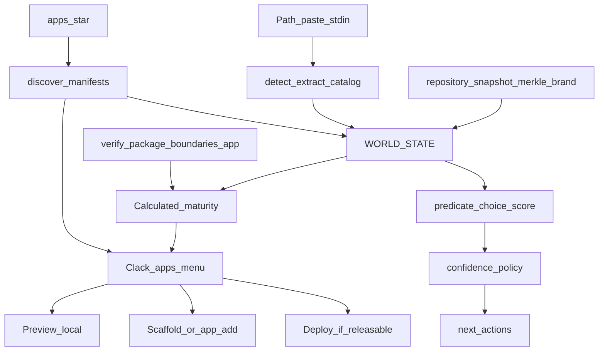

# Machine-first AgentSam + Apps Clack Catalog

**Home:** [`/Users/samprimeaux/agentsam-sdk`](/Users/samprimeaux/agentsam-sdk) · supersedes pending todos in [UNIVERSAL-INGEST-MACHINE-FIRST-2026-09-24.md](./UNIVERSAL-INGEST-MACHINE-FIRST-2026-09-24.md)

**Locked product intent:** Apps become a Clack/TUI selectable catalog of packaged previews/prebuilds of past work. Selecting an app leads to Preview (primary), then Scaffold/Add, then Deploy when maturity allows. Machine Intelligence + world-state make that catalog honest (calculated maturity, not hand badges).

## Intent (unchanged except Apps UX)

Audit and strengthen in place. No repo redesign for package purity. Proof = real `apps/*` + harvested sites. Mini stays the tiny lane.

```text
MINI  — tiny local artifact (agentsam mini)
APP   — Clack catalog → preview / scaffold / npm distribute
WORLD — arbitrary path → world-state → progressive normalize
```

Maturity ladder (calculated, observable):

```text
harvested → scaffolded → wired → verified → releasable → production
```

## Architecture



## Current baselines to leverage (do not rebuild)

| Piece | Path | Use |
|-------|------|-----|
| CLI router (`app`/`apps` alias) | [`src/cli.js`](/Users/samprimeaux/agentsam-sdk/src/cli.js) | Route bare `apps` → TUI |
| App commands today | [`src/commands/app.js`](/Users/samprimeaux/agentsam-sdk/src/commands/app.js) | Extend discovery + actions; today only `agentsam.app.json` (4 product apps) |
| Clack already | `@clack/prompts` in help/models/providers/scaffold | Same patterns for apps menu |
| Inspect | [`src/commands/product.js`](/Users/samprimeaux/agentsam-sdk/src/commands/product.js) → [`repository-snapshot.js`](/Users/samprimeaux/agentsam-sdk/src/capabilities/repository-snapshot.js) | Expand into world-state envelope |
| Progression / next | [`src/progression/engine.js`](/Users/samprimeaux/agentsam-sdk/src/progression/engine.js) | Feed maturity next-actions |
| Brand Intelligence | [`docs/BRAND_INTELLIGENCE.md`](/Users/samprimeaux/agentsam-sdk/docs/BRAND_INTELLIGENCE.md) + `packages/agentsam-brand` | Consumer of world-state + primitives |
| Verify | `scripts/verify-package.mjs`, `verify-source-boundaries.mjs` | Strengthen; wire into maturity |
| Theme apps | `.agentsam/app.json` on 7 harvested sites | Include in catalog (today invisible to `listAppManifests`) |

---

## Batch A — Machine Intelligence foundation

### A1. Docs
- Add [`docs/MACHINE_INTELLIGENCE.md`](/Users/samprimeaux/agentsam-sdk/docs/MACHINE_INTELLIGENCE.md): ladder, MINI/APP/WORLD, confidence ≠ risk, receipts, LLM as one handler.
- Cross-link Brand Intelligence + Repository Intelligence + this Apps catalog.
- Demote mini as architectural poster in help copy (Batch D completes that).

### A2. Decision primitives (AgentSam-owned)
- New module under `src/intelligence/` (or `packages/agentsam-intelligence` if boundary requires): `predicate`, `choice`, `score`, `distribution`.
- Confidence policy: abstention, hierarchical degrade, confidence ≠ risk.
- Decision receipts: `{input_hash, primitive, result, confidence, risk?, next}`.
- Protocol schemas under `protocol/` mirroring brand capability style.
- First consumer path: classify app maturity gate OR brand scan route — one real path with a receipt, not a demo.

**Acceptance A:** Doc lands; ≥1 classification path emits a decision receipt without a model.

---

## Batch B — World-state + every app observable

### B1. World-state envelope
Converge into one JSON envelope (new capability `world.state` or extend `repository.snapshot` with a stable `world` view):

- files / hashes / MIME (snapshot + merkle)
- AST / routes / APIs (existing intelligence slices)
- brand packet (when present)
- app manifest + provenance
- verify receipts
- maturity + next_actions

`agentsam inspect [path]` returns this envelope for arbitrary paths **and** every `apps/*`.

### B2. Discovery + maturity engine
Extend [`listAppManifests`](/Users/samprimeaux/agentsam-sdk/src/commands/app.js):

1. Prefer `agentsam.app.json` (product apps).
2. Fall back to `.agentsam/app.json` (theme-refinery / harvested).
3. Still list dirs under `apps/` that lack manifests as `harvested` with low maturity (observable, not hidden).

Calculated maturity gates (facts, not labels):

| Stage | Gate examples |
|-------|----------------|
| harvested | dir exists; optional gallery/canonical paths |
| scaffolded | package.json / wrangler / preview root present |
| wired | bin + commands.preview/doctor resolve |
| verified | doctor + app contract / boundary checks pass |
| releasable | verify receipts green; no donor junk in publish set; secrets marked |
| production | deploy receipt / remote binding evidence |

### B3. Strengthen verify-\*
- `verify-package` / `verify-source-boundaries`: keep; add app-level contract checks invoked by `agentsam app doctor` and maturity.
- Imperfect apps stay listed; failures become receipts on the catalog row.

**Acceptance B:** `agentsam inspect apps/cad-creator` and `agentsam inspect apps/church-site` both emit world-state; `agentsam app list --json` shows maturity for every `apps/*`.

---

## Batch C — Universal ingest → world-state

- Paste / path / stdin → detect → extract → sensitive candidates (confidence ≠ risk; redact before preview/model) → catalog → world-state.
- Safe localhost gallery / Brand Packet = projections of world-state.
- Fixtures = harvested sites + real app slices (not mini, not toy repos).
- Wire into existing ZIP ingest only as one path (`scripts/ingest-app-zips.py`); CLI front door is `agentsam inspect` / shell paste, not a separate product brand.

**Acceptance C:** Ingest a harvested site fixture → world-state row appears in apps discovery or inspect output with sensitive fields redacted.

---

## Batch D — Apps Clack catalog + distribute + mini clarity

### D1. Clack TUI is the primary `agentsam apps` UX (locked)

When TTY and no subcommand (or `--interactive`):

```text
agentsam apps
  → Clack select: catalog of apps
       label: name · id · maturity · kind(product|theme|incoming)
  → Clack select: action
       Preview | Info | Doctor | Scaffold / Add | Deploy
```

**Action rules (locked):**

| Action | When enabled | Behavior |
|--------|--------------|----------|
| **Preview** | maturity ≥ scaffolded and preview command/bin exists | Existing `runAppBin(..., preview)` / theme gallery preview — local packaged prebuild |
| **Info** | always | Manifest + world-state summary |
| **Doctor** | wired+ | Existing doctor bin / calculated checks |
| **Scaffold / Add** | scaffolded+ | `agentsam app scaffold <id> <dir>` or new `agentsam app add <id>` into cwd/target; ships runtime/scaffold only |
| **Deploy** | maturity ≥ releasable | Delegate to existing app wrangler / `agentsam deploy` path; refuse with next_actions if below gate |

Non-TTY / scripted: keep `agentsam app list|info|doctor|preview|scaffold` and add:

- `agentsam app add <id> [dir]`
- `agentsam app list --json` (maturity fields)
- `agentsam apps` with args still routes to same command tree

Implementation touchpoints:

- Expand [`src/commands/app.js`](/Users/samprimeaux/agentsam-sdk/src/commands/app.js) with `runAppsInteractive()` using `@clack/prompts` `select` / `confirm` (same style as [`src/ui/cli/help.js`](/Users/samprimeaux/agentsam-sdk/src/ui/cli/help.js)).
- [`src/cli.js`](/Users/samprimeaux/agentsam-sdk/src/cli.js): bare `apps` with empty argv → interactive; `app list` stays non-interactive default for scripts.

### D2. npm distribute
- Curate publishable set for product apps (cad / cms / studio / ecommerce) toward `@inneranimalmedia/<app>` or documented `agentsam app add` from registry.
- Exclude donor/reference junk per existing RELEASES / local-studio donor notes.
- Catalog marks `distributable: true` only when releasable gates pass.

### D3. Mini lane
- Keep `agentsam mini` working; docs/help state it is the tiny utility lane, not the proof of architecture.
- Apps catalog is the poster for packaged past work.

**Acceptance D:** On a TTY, `agentsam apps` opens Clack menu listing product + harvested apps with maturity; selecting Preview boots a local prebuild; Deploy is offered only for releasable apps; `agentsam mini` still works; docs state MINI/APP/WORLD.

---

## Explicit non-goals

- Repo redesign for package purity
- New toy apps as proof
- Hiding imperfect apps from the catalog
- TypeSafe/Jev vocabulary
- Auto-fetch remotes / execute imported HTML
- Jumping every path to LLM
- Replacing `agentsam shell` interactive UI work (already planned separately)

## Execution order

1. **Batch A** (docs + primitives) — unblocks vocabulary
2. **Batch B** (world-state + maturity + verify + discovery) — unblocks honest catalog
3. **Batch D1** (Clack `agentsam apps` menu) — ship usable select/preview as soon as maturity stubs exist; refine gates as B hardens
4. **Batch C** (ingest → world-state) — feeds catalog/inspect
5. **Batch D2–D3** (npm distribute + mini framing)

Suggested first PR slice after plan approval: A1+A2 + B2 discovery expansion + D1 Clack menu with stub maturity (wired from manifest presence), then deepen world-state/verify.

## Validation (each batch)

- `node --check` on touched JS
- Existing `test/cli/*.test.mjs` + new tests for maturity calculation and interactive path (mock Clack or non-TTY `--json`)
- `npm run verify:package` / `verify:boundaries` before any distribute claim
- Manual TTY: `agentsam apps` → select `local-studio` → Preview

## Optional hygiene (non-blocking)

Review leftover `/Users/samprimeaux/agent-worktrees/*` clones (stale SDK @ 892 behind, etc.) when convenient.