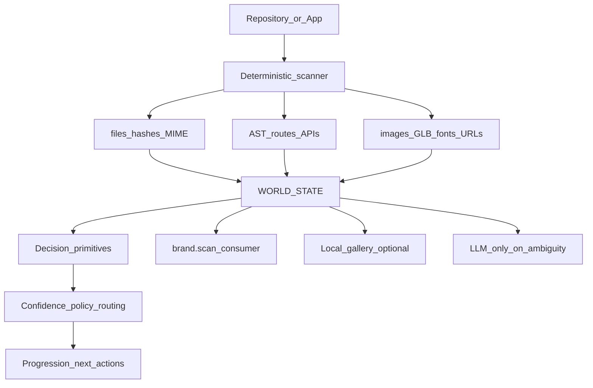

# Machine-first AgentSam — strengthen worlds in place

## Intent (locked)

**Audit and strengthen the current system. Do not redesign the repo around package purity.**

Home: [`/Users/samprimeaux/agentsam-sdk`](/Users/samprimeaux/agentsam-sdk) @ clean `main` (`c017da3` Brand Intelligence).

Preserve ownership:

| Layer | Role |
|-------|------|
| `apps/*` | Product authoring SSOT — real worlds at uneven maturity |
| `packages/*` | Reusable / packageable capability surfaces |
| `protocol/*` | Portable contracts + evidence |
| `src/*` | AgentSam runtime / CLI machinery |
| `mini` | Intentionally tiny utility lane — **not** the architectural proof |

**Proof already exists:** `local-studio`, `cad-creator`, `client-cms-editor`, `ecommerce-cms-agentsam`, seven harvested sites. Imperfection is maturity state, not exclusion:

```text
harvested → scaffolded → wired → verified → releasable → production
```

## Product scales

```text
MINI  — tiny local artifact, instant preview, seconds
APP   — complete packaged product (npm install / agentsam app add), minutes
WORLD — arbitrary repo → deterministic world state → progressive normalize
```

---

## Branch audit — COMPLETE (2026-09-24)

Repo now: **local `main` only**, synced to `origin/main` @ `c017da3`. No linked git worktrees besides the primary checkout.

### Deleted (fully on main — tip == merge-base / 0 ahead)

| Branch | Local | Remote | Notes |
|--------|:-----:|:------:|-------|
| `chore/package-release-system-20260923` | deleted | deleted | ancestor |
| `feat/cad-project-tools-20260922` | deleted | deleted | + worktree removed |
| `feat/feature-capability-snapshots-20260924` | deleted | deleted | ancestor |
| `fix/local-studio-cms-resolution-and-route-map-20260924` | deleted | deleted | ancestor |
| `integrate/identity-oauth-finish-20260924` | deleted | n/a | + worktree removed |
| `integrate/unified-tool-provider-event-contracts-20260924` | deleted | deleted | + worktree removed |
| `feat/unified-tool-provider-event-contracts-20260923` | n/a | deleted | cherry-`+` completeful commit superseded on main |
| `feat/agentsam-queue-control-20260923` | n/a | deleted | 0 ahead / 33 behind |
| `feat/goap-planner-backend` | n/a | deleted | 0 ahead / 112 behind |
| `rescue/ecommerce-cms-untracked-20260919` | n/a | deleted | 0 ahead / 125 behind |

### Errors-v1 claim — verified, then deleted

| Branch | Ahead by SHA | Verdict |
|--------|-------------:|---------|
| `feat/errors-v1-runtime-contract` | 44 | Remotes already gone. Knowledge/Gemini/error adapter files **byte-identical to main** (reconcile via `976506d` / PR #53). Only `test/error-diagnostics.test.mjs` differed; **main is newer**. No unique work to cherry-pick. |
| `integrate/errors-v1-main` | 40 | Same story; overlaps feat line. Deleted local tip. |

### Remaining git branches

**None** (besides `main` / `origin/main`).

### Leftover disk (not git branches — optional hygiene)

Under `/Users/samprimeaux/agent-worktrees/` (not registered with `git worktree list`):

| Dir | Approx | Note |
|-----|--------|------|
| `agentsam-lab` | clone on `main` | separate checkout |
| `agentsam-sdk` | clone **892 behind** origin/main | stale duplicate — safe delete candidate |
| `auth-scoped-terminal-lanes` | ~55M | no `.git`; contains `AgentSamRemix` |
| `cad-release` | empty | leftover shell |
| `gemini-env` | ~53M | contains `inneranimalmedia` tree |
| `mcp-account-owned-code-retrieve` | ~254M | MCP server tree |
| `mcp-search-execute-stabilization` | ~254M | MCP server tree |
| `memory-v2-contract` | ~2.3M | MCP server tree |

These are **disk clutter**, not unfinished SDK feature branches. Clean when ready; not blocking Batch A–D.

---

## Logical batches of work left (on main)

No branch merge queue. All remaining work is **new implementation on clean main**, grouped as:

### Batch A — Machine Intelligence foundation
**Todos:** `machine-intel-docs`, `decision-primitives`

- `docs/MACHINE_INTELLIGENCE.md` + protocol schemas for predicate / choice / score / distribution + decision receipts
- Shared AgentSam-owned primitives + confidence policy (confidence ≠ risk; abstention; hierarchical degrade)
- Cross-link Brand Intelligence + ingestion as consumers of the same ladder
- Framing: LLM is one handler inside AgentSam

### Batch B — World-state + every app observable
**Todos:** `world-state`, `app-maturity`, `verify-strengthen`

- Converge Merkle / `repository.snapshot` / AST / brand / harvest / manifests into one **world-state** envelope
- `agentsam inspect` works for arbitrary paths **and** every `apps/*`
- Calculated maturity + provenance + hashes + capabilities + relationships + verify receipts + next actions
- Strengthen `verify-package.mjs`, `verify-source-boundaries.mjs`, app contract tests, registry receipts
- Prefer calculated facts over hand labels; imperfect apps stay included

**Current app surface (proof targets, not toys):**

| App | Manifest signal |
|-----|-----------------|
| `cad-creator` | `agentsam.app.json` + `.agentsam/app.json` |
| `client-cms-editor` | same |
| `ecommerce-cms-agentsam` | same |
| `local-studio` | same |
| `church-site` … `shinshu-site` (7 harvested) | `.agentsam/app.json` (theme-refinery) |
| `theme-gallery-preview`, `frontend`, `_incoming` | maturity TBD via calculated gates |

### Batch C — Ingest feeds world-state
**Todos:** `ingest-on-worlds`

- Paste / path / stdin → detect → extract → catalog → world-state
- Sensitive candidates: confidence ≠ risk; redact before preview/model
- Safe localhost gallery / Brand Packet = **projections** of world-state
- Fixtures = harvested sites + real app slices (not mini, not toy repos)

### Batch D — APP distribution + mini lane clarity
**Todos:** `app-distribute`, `mini-keep-tiny`

- Graduate curated apps toward `npm install @inneranimalmedia/<app>` / `agentsam app add`
- Ship runtime/build/scaffold; exclude donor/reference junk
- Keep mini as scaffold/preview/zero-dep utilities; demote from poster-child docs/help

### Optional — Disk hygiene
**Todo:** `disk-clutter`

- Review/remove stale `agent-worktrees/*` clones (especially `agentsam-sdk` @ 892 behind)

---

## Architecture (unchanged)



## Explicit non-goals

- Repo redesign for package purity
- New toy/demo apps as architectural proof
- Requiring finished status before inclusion
- TypeSafe/Jev dependency or product vocabulary
- Mini as showcase
- Auto-fetch remotes / auto-delete orphans / execute imported HTML
- Jump every path to Level-4 LLM

## Acceptance

Without a model, AgentSam can:

1. List every `apps/*` with calculated maturity + provenance + verify status
2. `agentsam inspect` a harvested site and a serious app → world-state
3. Answer what/where/contents/capabilities/reusable/missing/verified/next from receipts
4. Expose decision primitives + a confidence-policy receipt on ≥1 classification path
5. Keep `agentsam mini` working as the tiny lane
6. Docs state machine-first ladder + MINI/APP/WORLD

Suggested next execution: **Batch A** (docs + decision primitives), then **Batch B** against real apps.
